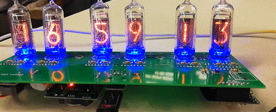
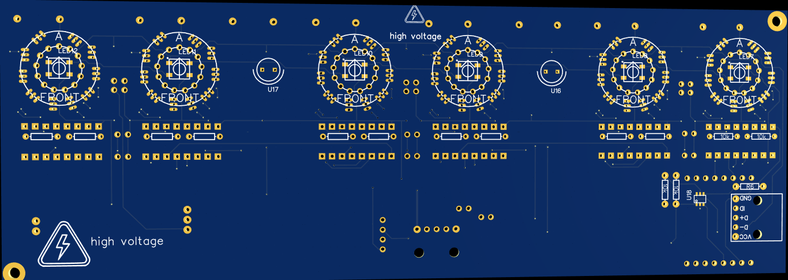
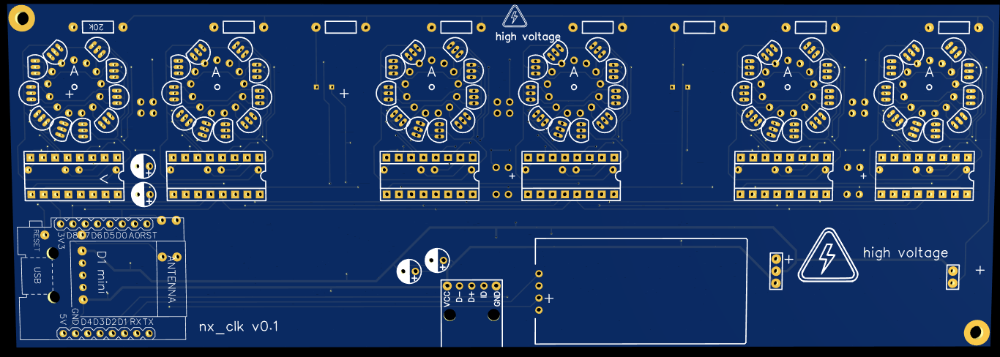
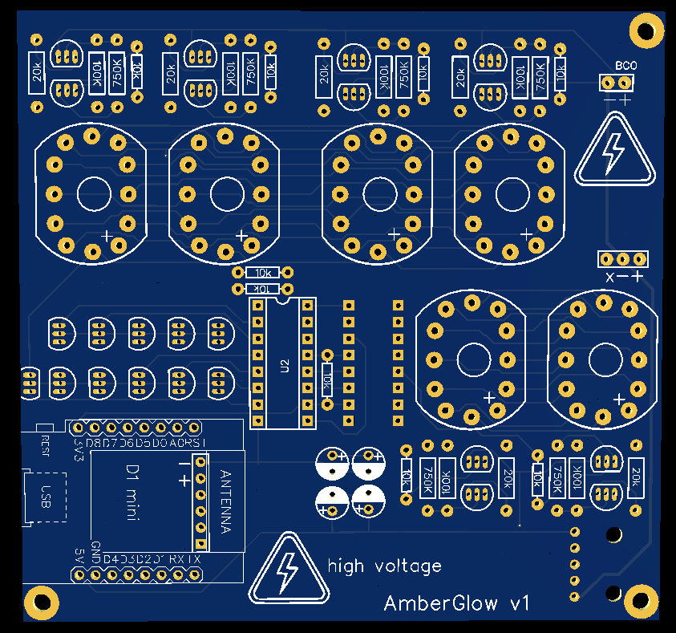
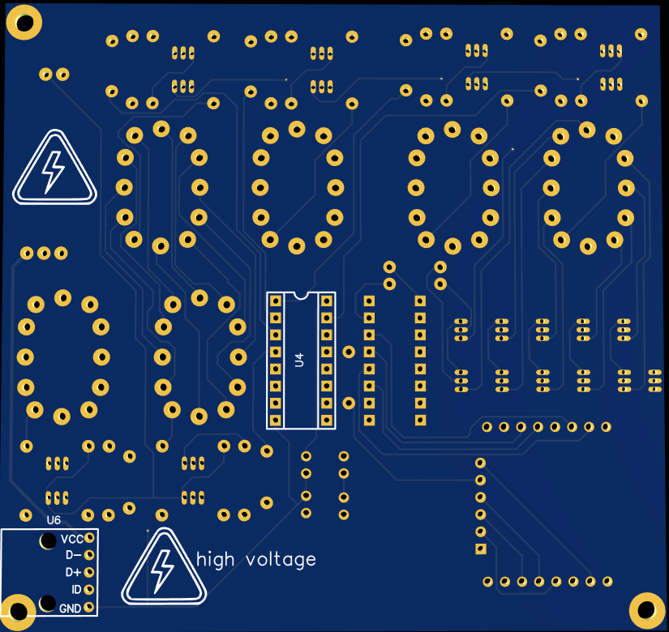

# What is this project:

This project house the circuit borad design file and the firmware source code for the Internet of Things Russian Nixie display tube digital clock.

 

Russian [Nixie display tubes](https://en.wikipedia.org/wiki/Nixie_tube) are beautiful vintage display technologies that glows amber in the shape of numberic symbols when connected to a power source.

# Circuit borads:

To contol/drive the Nixie display tube, I had designed two circuit borads name `nx_clk` and `AmberGlow`. (source files available soon)

* nx_clk front and back

* AmberGlow front and back

# Note for firmware contributors:

## Project status
The main features are completed, additional features are to be added.
    
### TODO:
* ntp client
* fix rgb driver
* cleanup, refactor, cleanup debug statements
* brghtness adjust support
* multiplex scanning support
* rgb tea light
* clock overflow animation
* wifi password
* tcp ssl auth

### completed:
* clock display
* wifi tcp server
* communication driver (mcu to rtc, mcu to shift reg)
* script (tcp client) to set time

## compiling & uploading
The software can be compiled and uploaded to the MCU (esp8266) using pio(platformio) command-line tools / ide plugin (gui)

### with `pio` command-line tool
#### Setting up `pio`
1. git clone the project file (not required if you alread have the files)
2. (optional; recommended;)
create python virtual environment (with virtualenv, or python -m venv) and activates the virtual environment; you will have to reactivate the environment if you restart your terminal;
3. install `platformio` with pip

#### compiling
4. `cd` into ignition dir (one where `platformio.ini` is in, run `ls` to check)
5. run `pio run` to compile the software. (first run may take longer since `pio` also install the requires toolchain)

    issues you may run into:

        `command not found`: remember to activate your python environment

#### uploading
6. unplug mcu from board
7. connect mcu to computer
8. run `pio device list` to find the port mcu is connected to.
    
    if the device is not found, you may need to install the driver,
    install the CH340 driver and restart machine (driver can be found on the d1 mini website. [link to driver](https://wiki.wemos.cc/downloads))
9. run `pio run --target upload --upload-port PORT_TO_UPLOAD`
    
    * omit `--upload-port PORT_TO_UPLOAD` to let pio auto detect port.

    * add `--target monitor` to open terminal after upload 

    * under linux, PORT_TO_UPLOAD is usually /dev/ttyUSB0.
